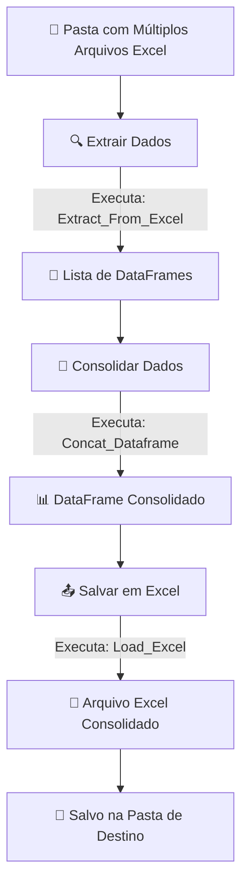

# Minha Documentação

Documentação de estrutura de projeto

## Workflow

```mermaid
graph TD;
    A[📁 Pasta com Múltiplos Arquivos Excel] --> B[🔍 Extrair Dados];
    B -- Executa: Extract_From_Excel --> C[📄 Lista de DataFrames];
    C --> D[🔄 Consolidar Dados];
    D -- Executa: Concat_Dataframe --> E[📊 DataFrame Consolidado];
    E --> F[📤 Salvar em Excel];
    F -- Executa: Load_Excel --> G[💾 Arquivo Excel Consolidado];
    G --> H[📁 Salvo na Pasta de Destino];
```

## Função de transformação de dados

### ::: app.pipeline.extract.extract_from_excel